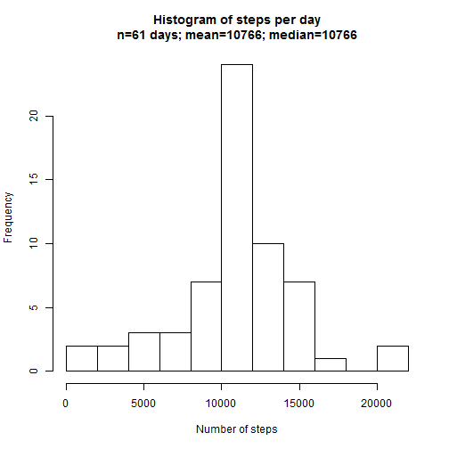

# Reproducible Research: Peer Assessment 1


## Loading and preprocessing the data
This code assumes that the file *activity.zip* is in the current working directory. 
First we unzip it, then load the generated *activity.csv* into the workspace.
At this time we also:
* convert the date variable into POSIXct format using the lubridate ymd() function.
* convert the interval to clock time first by prepending leading zeros to get a
 four digit interval, then extracting hour and minute  
Individual analyses for each of the required plots are performed in that plot's section below, rather than in the preprocessing stage.


```r
library(lubridate)
unzip("activity.zip")
activity <- read.csv("activity.csv", header = T, sep = ",")
activity$date <- ymd(activity$date)
activity$interval <- as.POSIXct(strptime(sprintf("%04d", activity$interval), 
    format = "%H%M"))
```


## What is mean total number of steps taken per day?
Next we create a data frame *daybyday* aggregating the total sum of steps for each day.


```r
daybyday <- aggregate(steps ~ date, data = activity, sum)
```

and plot a histogram of the resulting data  
* add breaks=10 to give a little finer granularity on the histogram  
* add a title showing mean, median and day counts

```r
maintitle <- paste("Histogram of steps per day\n", "n=", nrow(daybyday), " days", 
    "; mean=", round(mean(daybyday$steps)), "; median=", round(median(daybyday$steps)), 
    sep = "")
hist(daybyday$steps, breaks = 10, main = maintitle, xlab = "Number of steps")
```

 

## What is the average daily activity pattern?
Here instead of aggregating sums by date, we aggregate means by interval across all dates and plot the data. Then we find the interval which has the maximum average number of steps and annotate the plot with that point. This gives us a picture of what an average day looks like for this test subject.

```r
averageday <- aggregate(steps ~ interval, data = activity, mean)
with(averageday, plot(steps ~ interval, type = "l"))
max_steps <- averageday[which.max(averageday$steps), ]
points(max_steps$interval, max_steps$steps)
text(max_steps$interval, max_steps$steps, pos = 4, paste("Maximum", round(max_steps$steps), 
    "Steps at", strftime(max_steps$interval, format = "%H:%M")))
```

 


## Imputing missing values
How many NAs are there total?

```r
narows <- which(is.na(activity$steps))
number.nas <- length(narows)
```

There are 2304 rows containing steps with NA values.  
Using lapply we step through each of these rows and extract what the interval is for that row. We then find out what the average number of steps for that time interval is from the previously calculated averageday data frame. This is combined into a list of imputed values by date and interval.
Next we copy the NA-ridden steps variable into a new variable in the analysis dataframe, and replace all the rows containing NA step values with imputed values.  
Finally we create a new dataframe analagous to daybyday aggregating the sum activity per day.


```r
imputers <- lapply(narows, function(x) {
    averageday$steps[which(averageday$interval == activity$interval[x])]
})
activity$imputed.steps <- activity$steps
activity$imputed.steps[narows] <- simplify2array(imputers)
daybyday.i <- aggregate(imputed.steps ~ date, data = activity, sum)
```

and plot a histogram of the resulting data  
* add breaks=10 to give a little finer granularity on the histogram  
* add a title showing mean, median and day counts

Note that the imputed values did not affect the overall mean, and only slightly affected the median value. The only major change is an additional 8 days included in the histogram. 

```r

maintitle <- paste("Histogram of steps per day\n", "n=", nrow(daybyday.i), " days", 
    "; mean=", round(mean(daybyday.i$imputed.steps)), "; median=", round(median(daybyday.i$imputed.steps)), 
    sep = "")
hist(daybyday.i$imputed.steps, breaks = 10, main = maintitle, xlab = "Number of steps")
```

 

## Are there differences in activity patterns between weekdays and weekends?
We return to using the activity data without imputed values. First we use the weekdays function to get a character list of all the day names in the data frame.  
Next we convert this list to an additional factor variable in the activity dataset which classifies each row as a weekend or weekday, assuming that weekends are Saturday and Sunday.  
Finally aggregate the mean steps across both interval and weekend/weekday status

```r
daynames <- weekdays(activity$date)
activity$daymode <- as.factor(simplify2array(lapply(daynames, function(x) {
    ifelse(x %in% c("Saturday", "Sunday"), "weekend", "weekday")
})))
daybyday2 <- aggregate(steps ~ interval + daymode, data = activity, mean)
```

Finally plot the activity data versus time interval and compare weekdays to weekends. This test subject appears to get up a few hours later on weekends. They remain a little more active on weekend evenings but are obviously not hanging out in dance clubs until closing time. 

```r
library(ggplot2)
library(scales)  #date_format() from scales used for x axis labels
ggplot(data = daybyday2, aes(x = interval, y = steps)) + geom_line() + facet_grid(daymode ~ 
    .) + scale_x_datetime(labels = date_format("%H:%M"), breaks = "4 hour")
```

 

```r

```

